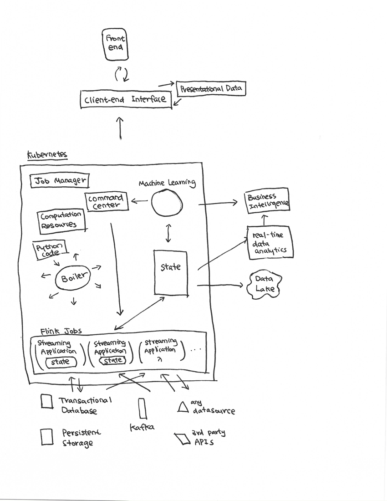

# 烧瓶锅炉

 [](https://travis-ci.com/billyrrr/flask-boiler) [](https://coveralls.io/github/billyrrr/flask-boiler?branch=master) [](https://flask-boiler.readthedocs.io/en/latest/?badge=latest) 

 “锅炉”： __B__ackend - __O__riginated __I__nstantly- __L__oaded __E__ntity __R__epository

注意：未分析或检查此软件包的内存使用情况。建议您使用Kubernetes来提高容错能力。 

Flask-boiler通过Firestore管理您的应用程序状态。您可以创建视图模型来汇总基础数据源，并将其立即永久存储在Firestore中。因此，您的前端开发将像使用Firestore一样容易。 Flask-boiler与Spring Web Reactive相当。 

演示： 

当您更改会议中一位参与者的出席状态时，所有其他参与者都会收到出席者列表的更新版本。 


您可能要使用此框架或架构实践的一些原因： 

*   You want to build a reactive system and not just a reactive view. 
*   You want to build a scalable app that is native to distributed  systems. 
*   You want a framework with a higher level of abstraction, so you can  exchange components such as transportion protocols 
*   You want your code to be readable and clear and written mostly  in python, while maintaining compatibility to different APIs. 
*   You have constantly-shifting requirements, and want to have  the flexibility to migrate different layers, for example,  switch from REST API to WebSocket to serve a resource. 

该框架处于___beta测试阶段___ 。无法保证API，并且___可能会___更改。 

文档： [阅读](https://flask-boiler.readthedocs.io/)文档

快速入门： [快速入门](https://flask-boiler.readthedocs.io/en/latest/quickstart_link.html) 

 API文档： [API文档](https://flask-boiler.readthedocs.io/en/latest/apidoc/flask_boiler.html) 

使用烧瓶锅炉的项目示例： [gravitate-backend](https://github.com/billyrrr/gravitate-backend) 

 [相关技术](https://medium.baqend.com/real-time-databases-explained-why-meteor-rethinkdb-parse-and-firebase-dont-scale-822ff87d2f87) 

## 理想用法

 Boiler会将您的python代码编译为flink作业，Web服务器以及其他将在kubernetes引擎（目前尚未实现）上运行的代码。 



## 介绍

锅炉在技术上是MVVM（Model-View-ViewModel），其中， 

1.   Model consists of a transactional database or datastore, and lives in back end. 
2.   ViewModel consists of a distributed state consists of Model and  aggregator. It is the main part of boiler. For client-read,  it receives the streams coming in from the Model layer, and  output them as a View to the View layer. For client-write,  it receives the change streams from View  layer, and operate on Model layer to persist the change.  ViewModel lives in the back end, and may be operated as  boiler python code, or compiled as flink jobs in the case of  big data application (to be implemented). 
3.   View is the presentational layer for the back end. It serves  1NF normalized data that are readable to the front end  without further aggregation. Client reads and writes to View.  View should be ephemeral, and can be rebuilt from ViewModel.  
     View may be a remote system, eg. firestore or leancloud. 

## 安装

在您的项目目录中， 

    pip install flask-boiler

在[快速入门中](https://flask-boiler.readthedocs.io/en/latest/quickstart_link.html)查看更多信息。 

<!--## Usage-->
<!--### Business Properties Binding-->
<!--You can bind a view model to its business properties (underlying domain model).-->
<!--See `examples/binding_example.py`. (Currently breaking)-->
<!--```python-->
<!--vm: Luggages = Luggages.new(vm_ref)-->
<!--vm.bind_to(key=id_a, obj_type="LuggageItem", doc_id=id_a)-->
<!--vm.bind_to(key=id_b, obj_type="LuggageItem", doc_id=id_b)-->
<!--vm.register_listener()-->
<!--```-->

### 国家管理

您可以合并在域模型中收集的信息并在Firestore中提供这些信息，以便前端可以读取单个文档或集合中所需的所有数据，而无需客户端查询和过多的服务器往返时间。 

有一篇中型[文章](https://medium.com/resolvejs/resolve-redux-backend-ebcfc79bbbea)介绍了一种类似的架构，称为“ reSolve”架构。 

有关如何使用flask-boiler在`` examples/meeting_room/view_models ``中公开“视图模型”的信息，请参见`` examples/meeting_room/view_models `` ，前端可以直接查询而不进行聚合。 

### 处理器模式

 `` flask-boiler ``本质上是源-接收器操作的框架： 

    Source(s) -> Processor -> Sink(s)

以查询为例， 

*   Boiler
*   NoSQL
*   Flink
    
    *   staticmethods: converts to UDF
    *   classmethods: converts to operators and aggregator's 
    
    
    

### 声明视图模型

<pre><code class="lang-python">class CityView(ViewModel):

    name = attrs.bproperty()
    country = attrs.bproperty()

    @classmethod
    def new(cls, snapshot):
        store = CityStore()
        store.add_snapshot("city", dm_cls=City, snapshot=snapshot)
        store.refresh()
        return cls(store=store)

    @name.getter
    def name(self):
        return self.store.city.city_name

    @country.getter
    def country(self):
        return self.store.city.country

    @property
    def doc_ref(self):
        return CTX.db.document(f"cityView/{self.store.city.doc_id}")
</code></pre>

### 文件检视

<pre><code class="lang-python">
class MeetingSessionGet(Mediator):

    from flask_boiler import source, sink

    source = source.domain_model(Meeting)
    sink = sink.firestore()  # TODO: check variable resolution order

    @source.triggers.on_update
    @source.triggers.on_create
    def materialize_meeting_session(self, obj):
        meeting = obj
        assert isinstance(meeting, Meeting)

        def notify(obj):
            for ref in obj._view_refs:
                self.sink.emit(reference=ref, snapshot=obj.to_snapshot())

        _ = MeetingSession.get(
            doc_id=meeting.doc_id,
            once=False,
            f_notify=notify
        )
        # mediator.notify(obj=obj)

    @classmethod
    def start(cls):
        cls.source.start()
</code></pre>

###  WebSocket视图

<pre><code class="lang-python">
class Demo(WsMediator):
    pass

mediator = Demo(view_model_cls=rainbow_vm,
                mutation_cls=None,
                namespace="/palette")

io = flask_socketio.SocketIO(app=app)

io.on_namespace(mediator)
</code></pre>

### 创建烧瓶视图

您可以使用RestMediator创建REST API。当您运行`` _ = Swagger(app) ``时，OpenAPI3 docs将在`` &lt;site_url&gt;/apidocs ``自动生成。 

<pre><code class="lang-python">app = Flask(__name__)

class MeetingSessionRest(Mediator):

    # from flask_boiler import source, sink

    view_model_cls = MeetingSessionC

    rest = RestViewModelSource()

    @rest.route('/&lt;doc_id&gt;', methods=('GET',))
    def materialize_meeting_session(self, doc_id):

        meeting = Meeting.get(doc_id=doc_id)

        def notify(obj):
            d = obj.to_snapshot().to_dict()
            content = jsonify(d)
            self.rest.emit(content)

        _ = MeetingSessionC.get(
            doc_id=meeting.doc_id,
            once=False,
            f_notify=notify
        )

    # @rest.route('/', methods=('GET',))
    # def list_meeting_ids(self):
    #     return [meeting.to_snapshot().to_dict() for meeting in Meeting.all()]

    @classmethod
    def start(cls, app):
        cls.rest.start(app)

swagger = Swagger(app)

app.run(debug=True)
</code></pre>

 （目前正在实施中） 

## 对象生命周期

### 一旦 Once

使用`` cls.new ``创建的对象-&gt;使用`` obj.to_view_dict ``导出的对象。 

### 多 Multi

在数据库中创建新域模型时创建的对象-&gt;基础数据源更改时对象更改-&gt;对象调用`` self.notify `` 

## 典型的ViewMediator用例

数据流方向描述为源-&gt;接收器。 “读取”描述了前端在Sink中发现有用数据的数据流。 “写入”描述了数据流，其中接收器是真实的唯一来源。 

### Rest

读取：请求-&gt;响应\\写入：请求-&gt;文档

1.   Front end sends HTTP request to Server 
2.   Server queries datastore
3.   Server returns response

### 询问

读取：文档-&gt;文档\\写入：文档-&gt;文档

1.   Datastore triggers update function 
2.   Server rebuilds ViewModel that may be changed as a result 
3.   Server saves newly built ViewModel to datastore 

### 查询+任务

读取：文档-&gt;文档\\写入：文档-&gt;文档

1.   Datastore triggers update function for document `` d `` at time `` t ``
2.   Server starts a transaction
3.   Server sets write\_option to only allow commit if documents are last updated at time `` t `` (still under design)
4.   Server builds ViewModel with transaction 
5.   Server saves ViewModel with transaction
6.   Server marks document `` d `` as processed (remove document or update a field)
7.   Server retries up to MAX\_RETRIES from step 2 if precondition failed 

###  WebSocket 

读取：文档-&gt; WebSocket事件\\写入：WebSocket事件-&gt;文档

1.   Front end subscribes to a ViewModel by sending a WebSocket event to server 
2.   Server attaches listener to the result of the query
3.   Every time the result of the query is changed and consistent:
    
    1.   Server rebuilds ViewModel that may be changed as a result 
    2.   Server publishes newly built ViewModel
    
    
    
4.   Front end ends the session
5.   Document listeners are released 

### 数据库文档 

读取：文档-&gt;文档\\写入：文档-&gt;文档

### 比较

 | |REST|查询|查询+任务| WebSocket |数据库文档| 
 | -----------------	|------ 	|-------	|------------	|-----------	|----------	|
 | Guarantees 	| ≤1 (At-Most-Once) 	| ≥ 1 (At-Least-Once) | =1\[^1\] (Exactly-Once) | ≤1 (At-Most-Once) 	| ≥ 1 (At-Least-Once) 	|
 | Idempotence 	| If Implemented | No | Yes, with transaction\[^1\] 	| If Implemented 	| No |
 | Designed For | Stateless Lambda | Stateful Container | Stateless Lambda | Stateless Lambda | Stateful Container |
 | 延迟 	| Higher | Higher 	| Higher | Lower 	| Higher 	|
 | 吞吐量 	| Higher when Scaled| Lower\[^2\] 	| Lower 	| Higher when Scaled	| Lower\[^2\] 	|
 | 有状态的 	| No 	 | If Implemented | If Implemented 	| Yes 	| Yes 	|
 | Reactive 	| No 	 | Yes | Yes 	| Yes 	| Yes 	|&lt;!--- Gaurantees 

消费者可以成功提交更改并将事件标记为已处理。 

## 优点

### 解耦域模型和视图模型

使用Firebase Firestore有时需要跨多个文档重复字段，以便查询数据并在前端正确显示它们。烧瓶锅炉通过将域模型和视图模型分离来解决此问题。视图模型随域模型的更改而自动生成和刷新。这意味着您只需要在域模型上编写业务逻辑，而不必担心数据将如何显示。这也意味着视图模型可以直接显示在前端，同时支持Firebase Firestore的实时功能。 

### 一站式配置

无需为数据库和其他云服务配置网络和不同的证书设置。您要做的就是在Google Cloud Console上启用相关服务，并添加证书。 Flask-boiler配置所需的所有服务，并将它们作为整个项目中的单例上下文对象公开。 

### 冗余

由于所有视图模型都保留在Firebase Firestore中。即使您的应用程序实例处于脱机状态，用户仍然可以从Firebase Firestore访问数据视图。每个视图也是烧瓶视图，因此，如果Firebase Firestore不可行，您还可以使用自动生成的REST API访问数据。 

### 增加安全性

通过将业务数据与前端可访问的文档分开，您可以更好地控制显示哪些数据，具体取决于用户的角色。 

### 一站式文档

所有ViewModel都有自动生成的文档（由Flasgger提供）。这有助于AGILE团队使他们的文档和实际代码保持同步。 

### 完全可扩展

当您需要更好的性能或关系数据库支持时，您始终可以通过添加诸如`` flask-sqlalchemy ``模块来重构特定层。 

## 比较

###  GraphQL 

在GraphQL中，每次查询都会对字段进行评估，但仅当基础数据源发生更改时，flask-boiler才会对字段进行评估。这样可以更快地读取一段时间未更改的数据。此外，由于读取了在一次交易中对Firestore进行的所有更改之后触发了字段评估，因此数据源也将是一致的。 

但是，GraphQL允许前端自定义返回值。您必须在烧瓶锅炉中定义要返回的确切结构。尽管如此，它还是有优势的，因为大多数请求和响应文档都可以与REST API相同的方式完成。 

###  REST API /烧瓶

 REST API不会缓存或存储响应。当烧瓶锅炉评估视图模型时，响应将永久存储在Firestore中，直到更新或手动删除为止。 

 Flask-boiler通过与Firestore集成的安全规则来控制基于角色的访问。 REST API通常使用JWT令牌控制这些访问。 

###  Redux 

 Redux主要在前端实现。 Flask-boiler以后端为目标，并且具有更高的可扩展性，因为所有数据都与Firestore（无限扩展的NoSQL数据存储）进行通信。 

 Flask-boiler是声明性的，而Redux是必须的。 REDUX的设计模式要求您在域模型中编写函数式编程，但是flask-boiler支持另一种方法：ViewModel从域模型读取和计算数据，并将该属性公开为属性获取器。 （在写入DomainModel时，视图模型会更改域模型，并将操作公开为属性设置器）。尽管如此，您仍然可以添加在域模型更新后触发的函数回调，但是这可能会引入并发问题，并且由于在烧瓶锅炉中进行设计折衷，因此无法完美支持。 

### 架构图： 


## 贡献

欢迎提出请求。 

请确保适当更新测试。 

## 开源软件许可

 [MIT](https://choosealicense.com/licenses/mit/) 

<div class="footnotes">
<hr/>
<ol></ol>
</div>